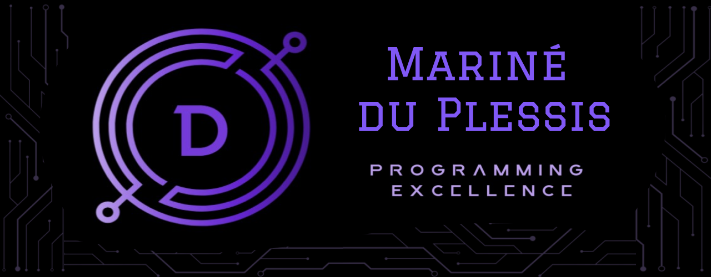

## 👋 Hi there!
I am an Open Window final year BA User Experience Design and Interactive Development student.
I see myself as a creative technologist that flourishes during the process of creating designs and bringing them to life.
I specialise in website and mobile app development.

## 🔧 Skills

### Software:

### Languages:

#### MERN Stack:

## 📌 Pinned Repositories

## 📈 GitHub Stats

## 📧 Contact Information

Email - mdp.marine@gmail.com

